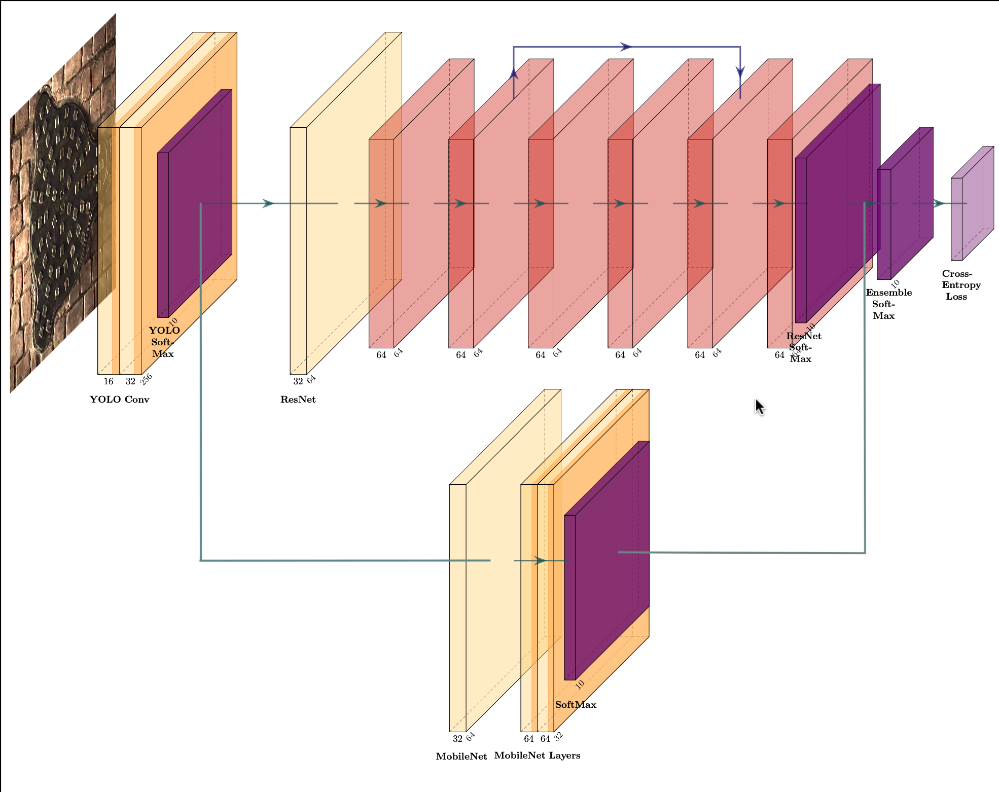
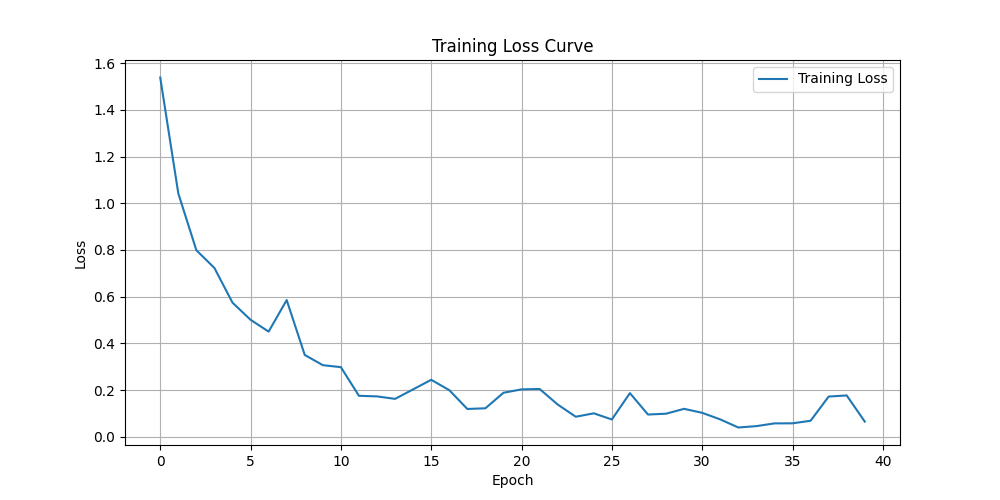
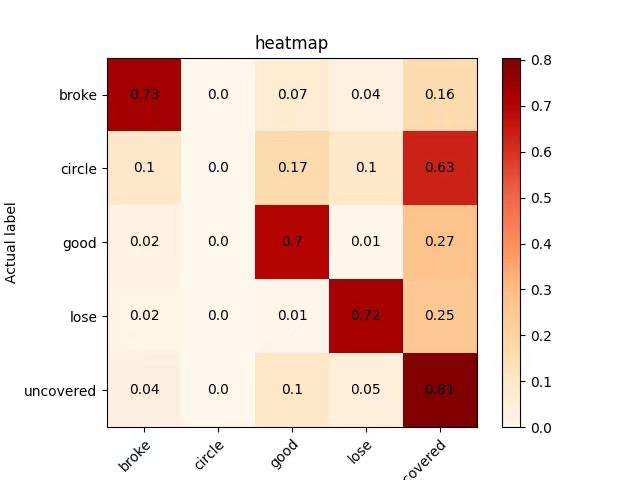
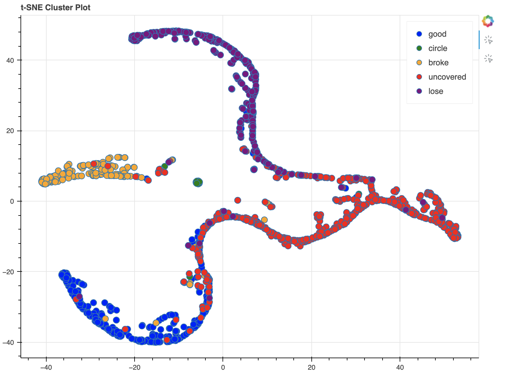
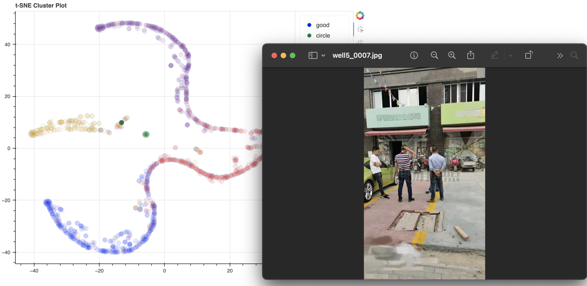

## Object Detection and Classification with Ensemble Model

This project implements an object detection and classification system using an ensemble model consisting of MobileNetV2
and ResNet50 architectures. The system is trained to detect and classify objects within images using bounding box
annotations.

### Project Structure

- `models/`: Directory to store trained model weights.
- `results/`: Directory to store output results such as training curves and detection results.
- `train_xmls/`: Directory containing XML annotations for training images each file corresponds to multiple objects in
  one image.
- `test_xmls/`: Directory containing XML annotations for testing images each file corresponds to multiple objects in one
  image.
- `datasets_expansion.py`: Utility functions to expand datasets, using six different augmentation techniques.
- `xml_data_split.py`: Script to split XML annotations into training and testing sets.
- `xml_split.py`: Split XML containing multiple objects into multiple XML files each containing one object.
- `train.py`: Script to train the ensemble model using expanded datasets.
- `train_v2.py`: Script to train the ensemble model using XML annotations.
- `t-SNE.py`: Script to visualize the feature space of the ensemble model using t-SNE.

### Requirements

- Python >= 3.10

### Setup

1. **Clone the repository using the following command:**

    ```bash
    git clone https://github.com/unknown918/Manhole-Classification.git
    ```

2. **Install the required packages:**

    ```bash
    pip install -r requirements.txt
    ```

3. **Train the model:**

    ```bash
    python3 train.py
    ```

4. **Visualize the feature space:**

    ```bash
    python3 t-SNE.py
    ```

### Tips

- **Different Frameworks:** We trained the models separately in two frameworks, one using TensorFlow with image data,
  and the other using PyTorch with XML files. If you intend to train based on PyTorch, please run **train_v2.py**. This
  program conducts testing automatically after training and saves the results in the 'result.txt' file. If you prefer
  training
  with TensorFlow, you can directly execute the command line above.
- **Datasets Expansion:** We expanded the datasets using six different augmentation techniques, including rotation,
  gaussian blur, noise addition, and brightness adjustment. You can use the **datasets_expansion.py** script to expand
  your datasets.

### Model Architecture

- The ensemble model ensembles features from MobileNetV2, ResNet50, and YOLOv8 architectures.
- MobileNetV2 is used for its lightweight design and ResNet50 for its deeper architecture, providing a balance between
  speed and accuracy.
- YOLOv8 is used for its object detection capabilities, which are combined with the classification features of
  MobileNetV2 and ResNet50.
  

### Results

- **Training Loss Curve:**
  The training loss curve is generated after training the model, showing the progression of loss over epochs.
  

- **Detection Results:**
  Detection results are stored in results/result.txt, including image name, predicted labels,
  confidence scores, and bounding box coordinates, we also provide the visualization of the detection results.
  

- **Feature Space Visualization:**
- The feature space of the ensemble model is visualized using t-SNE, showing the
  distribution of features in a 2D space.
  

- **Datasets Refinement:**
- Our t-SNE plot only requires a click to display the dataset image corresponding to each
  point, this enables you to refine your dataset based on the results of t-SNE.
  

### Computational Power Requirements

Our model is trained using cloud servers, leveraging a single NVIDIA 4090 GPU, with a training time of approximately
half an hour. For local training, a 3060 GPU is used, which takes around one hour. Additionally, a small dataset was
utilized for local testing across Linux, macOS, and Windows platforms, confirming the accuracy and reliability of the
training code.

### Contributors

- [Qianjing Yang](https://github.com/unknown918)
- [Jian Lei](https://github.com/LeiShang2004?query=2256726183%40qq.com)

### Contact

For any inquiries or issues, please contact [our email](8208221520@csu.edu.cn).


